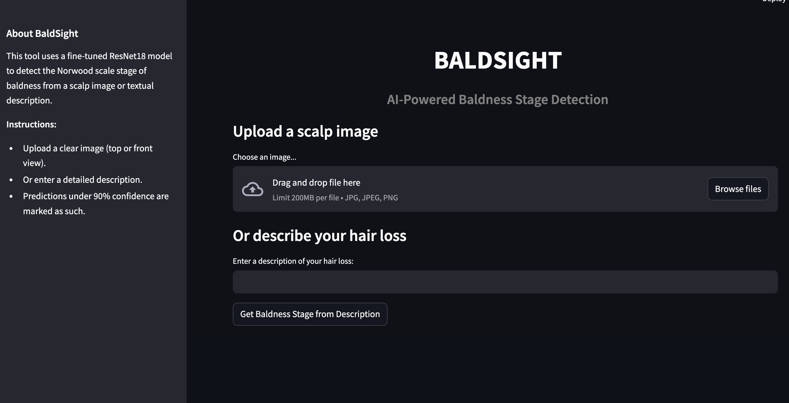
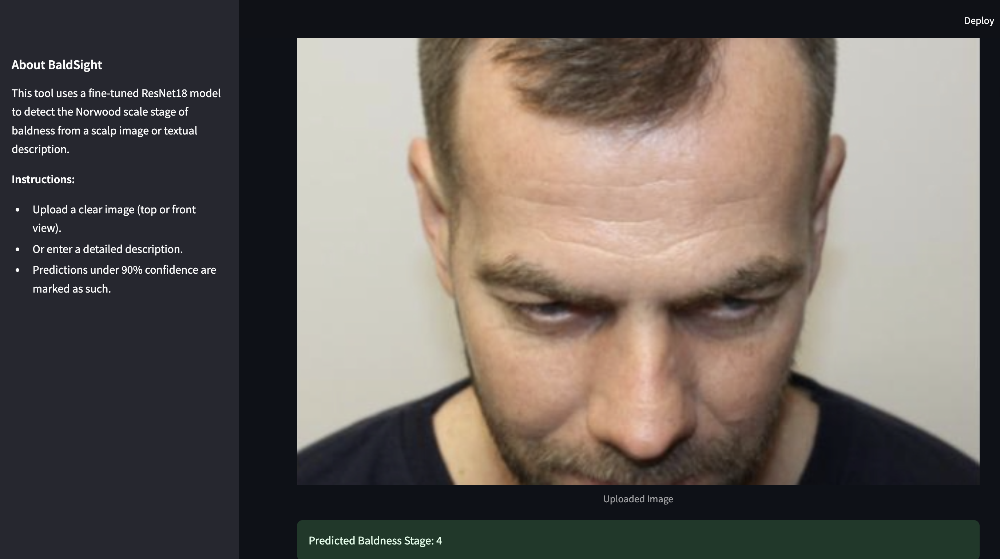

#  BALDSIGHT
**AI-powered hair loss analysis using ResNet18 & Gemini LLM**  
A multimodal diagnostic assistant that predicts Norwood stage from scalp images and text-based user descriptions.

##  App Preview

###  Web Interface (Streamlit)


---

###  Example: Image-Based Prediction


---

## PROJECT OVERVIEW

**BaldSight** is a hybrid deep learning application that combines computer vision and large language model (LLM) capabilities to estimate the stage of male pattern baldness using either:

- A **scalp image**, or  
- A **natural language description** of hair loss patterns.

Built for accessibility and real-world applicability, BaldSight helps users self-assess hair loss stages and understand their condition with higher confidence.

---

## KEY FEATURES

-  **ResNet18-based Norwood stage classification** from user-uploaded images  
-  **LLM (Gemini 1.5 Pro) inference** from descriptive text queries  
-  **Dynamic confidence scoring** with softmax thresholding (alert < 90%)  
-  **Streamlit-powered web interface** for rapid feedback  
-  **Modular architecture** for easy extension and integration  
-  **Tested Gemini API behavior** using mock evaluation

---

## TECH STACK AND TOOLS USED

| Component        | Tech Used                    |
|------------------|------------------------------|
| Frontend         | Streamlit                    |
| Backend & Logic  | Python, PyTorch, OpenAI Gemini |
| Image Model      | Pretrained ResNet18          |
| Prompting LLM    | Google Gemini 1.5 Pro        |
| Model Training   | TorchVision, Custom Dataset  |
| Logging          | Python logging module        |
| Utilities        | dotenv, Pillow, argparse     |

---

##  Repository Structure

```
BALDSIGHT/
├── app.py                 # Streamlit app entrypoint
├── config.py              # API keys, config constants
├── engine.py              # Core inference functions for image & text
├── model.py               # ResNet18 loading, model utils
├── predict.py             # CLI interface for image-based prediction
├── test_gemini.py         # Test cases for Gemini API inference
├── train_model.py         # Image classifier training script
├── utils.py               # Image transformations, preprocessing
├── datasets/              # Sample test images
├── saved_models/          # Pretrained ResNet18 checkpoint
├── logs/                  # Training and inference logs
├── .env                   # Gemini API key (DO NOT COMMIT)
├── training_metrics.png   # Accuracy/loss training graph
├── .gitignore             # Files to ignore in repo
└── README.md              # You're here
```
---

##  Installation & Setup


###  **Clone the Repository**
```bash
git clone https://github.com/aparna534/BALDSIGHT.git
cd BALDSIGHT
```

###  **(Optional) Create Virtual Environment**
```bash
python -m venv env
source env/bin/activate         # On Windows: .\env\Scripts\activate
```

###  **Install Dependencies**
```bash
pip install -r requirements.txt
```

###  **Add Gemini API Key**

Create a `.env` file in the root folder with:
```env
GEMINI_API_KEY=your_gemini_key_here
```
 _Make sure `.env` is listed in `.gitignore`._

---

##  Train the Model (Optional)

```bash
# Train the ResNet18 image classification model
python train_model.py
```

 Model checkpoint saved to `saved_models/`  
 Training logs saved to `logs/`  
 Accuracy/loss chart saved as `training_metrics.png`

---

##  Predict Baldness Stage (Image)

```bash
python predict.py --image path/to/image.jpg
```

 **Predicted Stage:** 4  
 **Confidence:** 91.4%

---

##  Test Gemini Text-Based Inference

```bash
python test_gemini.py
```

 Input: `"Hair thinning on crown"`  
 Gemini Output: `"This corresponds to Norwood Stage 3"`

_Make sure your `.env` file contains a valid `GEMINI_API_KEY`._

---

##  Launch Streamlit Web App

```bash
streamlit run app.py
```

Once launched in the browser:

-  Upload an image ➝ Get Norwood prediction  
-  Type a hair loss description ➝ Get Gemini inference

---

##  Author

By [Aparna Sivakumar](https://github.com/aparna534)

---

##  License

This project is licensed under the MIT License – see the [LICENSE](LICENSE) file for details.
